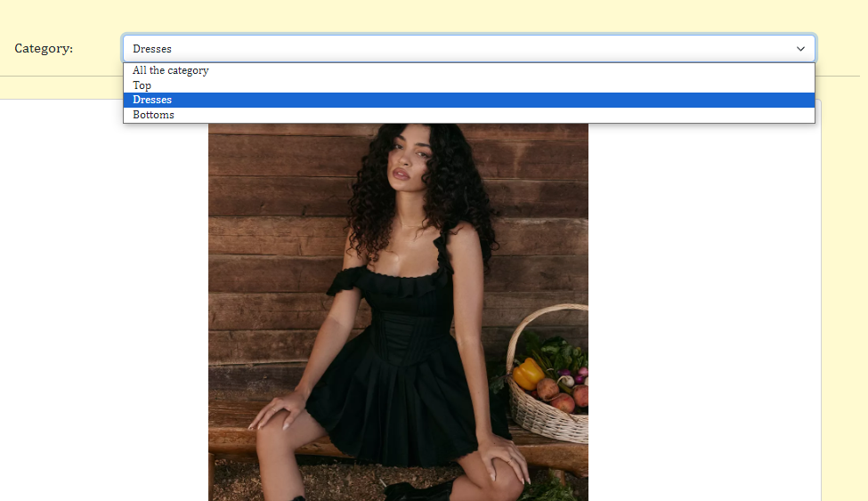

# Progetto d'esame
## Lia's House
**Silvia Lia** n° _matricola:847_
Graphic Design
ACME - 3°anno
A.A. 2023-2024
**Materia**:Web Design 2
**Docente**:Matteo Baccan

---


Quest'anno abbiamo creato un **sito multi pagina per un e-commerce**. Io ho optato per la realizzazione di un negozio virtuale specializzato in abbigliamento di lusso, sfruttando le mie competenze pregresse in **HTML, CSS e Javascript**.

Il repository è pubblicato a questo indirizzo: https://liashouse.netlify.app/

---
# Strumenti utilizzati
Per la creazione del sito e delle relative slide ho utilizzato: 
- Marp, Markdown Presentation Ecosystem
- GitHub, Codespace (Visual Studio Code)
- Bootstrap
- Chat GPT
- Netlify

---
# Marp: Creazione Slide

Marp conosciuto anche come _Markdown Presentation Ecosystem_ offre un approccio rapido e intuitivo per la creazione di slide basilari. Quello che noi dobbiamo fare è semplicemente scrivere un documento in **markdown**.


---
# Visual Studio Code: Programmazione

Ho usato il _code editor_ **Visual Studio Code**, per scrivere il codice del mio sito web. Ho clonato il mio repository di GitHub su VS, per poter **programmare offline** così che qualsiasi modifica successivamente si sincronizzasse direttamente con il mio repository di GitHub.

---

# Bootstrap
**Bootstrap** è una libreria di **strumenti liberi per la creazione di siti e applicazioni per il Web**. Essa contiene modelli di progettazione basati su HTML e CSS, sia per la tipografia, che per le varie componenti dell'interfaccia, come moduli, pulsanti e navigazione, così come alcune estensioni opzionali di JavaScript.


---
# Chat GPT

Ho usato questa IA, _intelligenza artificiale_ per **creare parte dei testi** all'interno del sito.

---
# Netlify: Pubblicazione

Per la pubblicazione del sito creato abbiamo utilizzato **Netlify**, società di cloud computing basata su servizi di hosting e back-end serverless per applicazioni Web e siti Web statici.

---
# Creazione del sito
---
# Struttura
Il sito è composto da 5 pagine principali: 
- **Home**
- **Brand**
- **Clothing**
- **Cart**
- **Contact**

Ogni pagina presenta degli elementi di base come la **navbar** e il **footer**

---
# Navbar

In alto abbiamo la **navbar** importante per la navigazione all'interno del nostro e-commerce.
Composta da vari elementi che permettono di avere un collegamento con le altre pagine del sito.


---
# Footer

In basso abbiamo il **footer** un elemento importante perchè vi sono le informazioni principali dell'azienda, come indirizzo email, numero di telefono.
Nel footer della Home e dei contacts è presente anche la posizione sulla mappa di Google Maps.


---
# Homepage

In alto abbiamo la **navbar** aseguire vi è lo **slider**, che scorre 3 fotografie diverse, successivamente vi sono altre informazioni e foto, infine vi è il **footer**. Una caratteristica importante è la presenza della finestra dei cookie.

---
# Slider

Nella home è presente questo slider, realizzato usando delle demo di [Swiper](https://swiperjs.com/demos) Il carosello iniziale prevede un **autoplay** generato grazie a javascript, con un intervallo di tempo specifico e la possibilità di fare swipe e vedere le altre diapositive, tre in totale.

---
# Codice js dello slider
```js
var swiper = new Swiper(".mySwiper", {autoplay: {
  
  delay: 2500,
  disableOnInteraction: false,
}});  
]
```
Questo codice JavaScript crea un oggetto "swiper" utilizzando la libreria Swiper, associato all'elemento HTML con la classe "mySwiper". Questo oggetto swiper è configurato per eseguire uno slideshow automatico con un ritardo di 2500 millisecondi tra le diapositive e per non interrompersi quando l'utente interagisce con esso.

---
# Cookie

I cookie sono piccoli file di testo memorizzati sul tuo dispositivo quando visiti un sito web. Essi svolgono diverse funzioni, tra cui il **tracciamento** delle tue attività, il **miglioramento** dell'esperienza utente, e la **memorizzazione** delle tue preferenze durante la navigazione su Internet.


---
# Codice js dei cookie
```js
//cookie
function hideCookie() {
  let cookie = document.querySelector("#innercookie");
  cookie.style = "display:none;";
}
function showCookie() {
  let cookie = document.querySelector("#innercookie");
  cookie.style = "display:block;";
}
```
Questo codice JavaScript definisce due funzioni. La prima, **"hideCookie"**, nasconde un elemento HTML con l'id **"innercookie"** per far sparire la finestra dei cookie. La seconda, "showCookie," fa l'opposto, mostrando l'elemento impostando il suo stile su **"display:block;"**. Queste funzioni possono essere utilizzate per gestire la visualizzazione di un elemento, come un avviso sui cookie, sulla pagina web.

---

# Brand
In questa pagina vi è una breve **descrizione** del brand, dei suoi valori e delle caratteristiche principali e nella parte inferiore sono presenti tre immagini.

---

# Clothing
All'interno di questa pagina sono presenti alcuni articoli dell'e-commerce con i relativi prezzi.
Inoltre è presente una barra di ricerca che **filtra i prodotti**.

---

# Filtro prodotti
La barra di ricerca è ideata espressamente per rendere più semplice la ricerca di un deteminato prodotto. In questo caso propone tre diverse categorie di vestiti **Dress, Top, Buttom**.

---
# Filtro prodotti
```js
function filterProducts() {
  // Seleziona tutti gli elementi della griglia di prodotti
  var products = document.querySelectorAll('.product');
  // Ottieni la categoria selezionata
  var selectedCategory = document.querySelector('#inputCategory').value;
  // Mostra solo i prodotti della categoria selezionata
  for (var i = 0; i < products.length; i++) {
      if (products[i].dataset.category === selectedCategory || selectedCategory==='tutte') {
          products[i].style.display = 'block';
      } else {
          products[i].style.display = 'none';
      }
// Mostra tutti i prodotti all'avvio della pagina
filterProducts();
```

Questo codice JS definisce una funzione chiamata **"filterProducts"** che filtra e mostra solo i prodotti in base alla categoria selezionata dall'utente. Gli elementi HTML con la classe **"product"** vengono nascosti o mostrati in base alla categoria selezionata dall'utente. Inoltre, all'avvio della pagina, vengono inizialmente mostrati tutti i prodotti.

---

# Prodotto Singolo
Questa è la pagina del singolo prodotto, caratterizzata da una breve descrizione del prodotto e da due selezioni, la quantità e le taglie.
Vi è quindi la possibilità di scegliere quanti prodotti e di quale taglia mettere nel carrello.

---
# Funzioni per il prodotto
```js
function visualizzaTaglie() {
      var taglie = document.getElementById("taglie");
      var taglieup = document.getElementById("taglieup");
      var tagliedown = document.getElementById("tagliedown");
      if (taglie.style.display === "none") {
        taglie.style.display = "block";
        taglieup.style.display = "block";
        tagliedown.style.display = "none";
      } else {
        taglie.style.display = "none";
        taglieup.style.display = "none";
        tagliedown.style.display = "block";
      }
    }
    function cambiaTaglia() {
      var taglia = document.getElementById("taglia");
      taglia.value = event.target.innerHTML;
    }

    function addToCart() {
      alert("Prodotto aggiunto al carrello");
    }
```
---
Questo codice JavaScript contiene tre funzioni. La prima, **"visualizzaTaglie,"** controlla la visualizzazione di un elemento con id **"taglie"** e cambia l'aspetto di altri due elementi **"taglieup"** e **"tagliedown"** in base alla sua visibilità. La seconda funzione, **"cambiaTaglia,"** imposta il valore di un elemento con id "taglia" al testo interno dell'elemento che ha scatenato l'evento. Infine, la terza funzione, **"addToCart,"** mostra una semplice notifica che indica che il prodotto è stato aggiunto al carrello.


---

# Cart
La pagina del carrello non è completamente funzionante, al momento è possibile aggiungere i prodotti al suo interno, ma non è visibile direttamente nel carrello.

---

# Contatti
In questa sezione, sono presenti i **dati di contatto** principali dell'e-commerce e un **modulo** che consente alle persone di mettersi in contatto direttamente con noi attraverso questa pagina.

---
# Analisi [GTmetrix](https://gtmetrix.com/)
GtMetrix è uno dei migliori strumenti per testare la velocità e prestazioni di un sito.


---


---

# Grazie per l'attenzione
Silvia Lia
